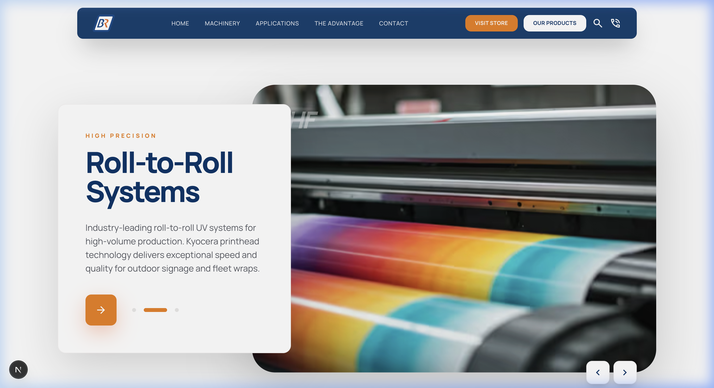
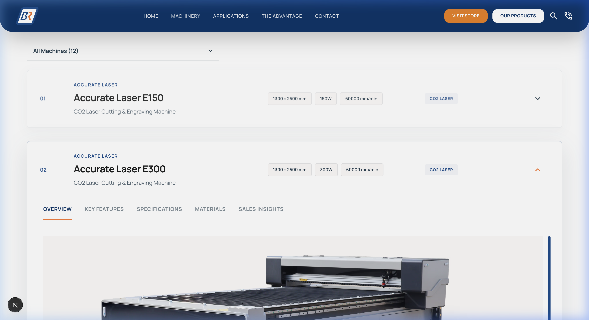
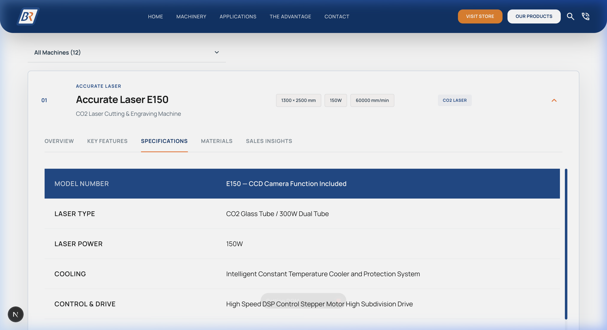
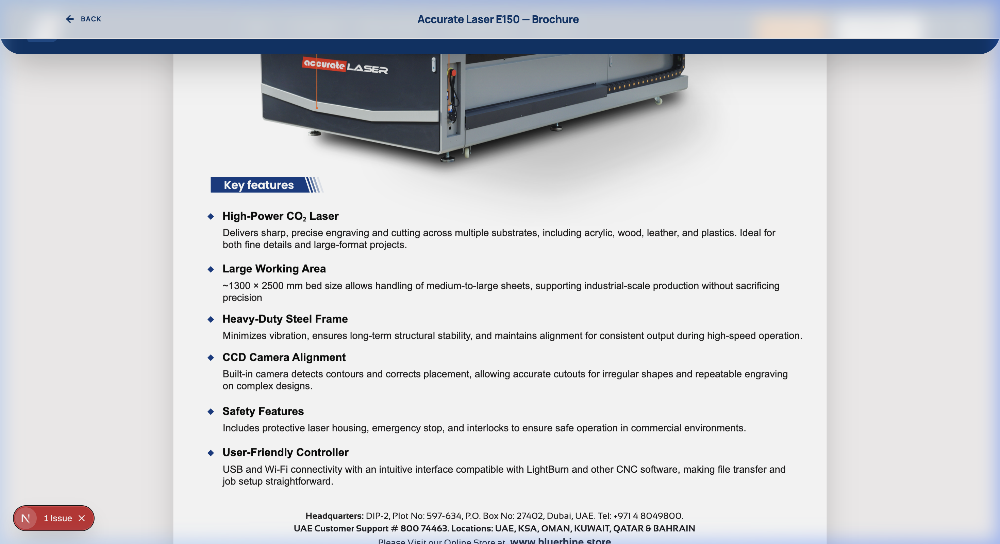
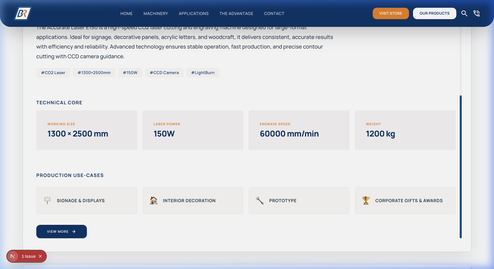

# Blue Rhine — Machinery Catalogue

A professional, high-performance machinery catalogue built with **Next.js 16**, **React 19**, and **Tailwind CSS**. This application features a data-driven industrial interface for browsing technical specifications, viewing interactive machine diagrams, and exploring production use-cases.

## 📸 Visual Highlights

### 1. Hero & Navigation
The homepage features a sleek, brutalist-inspired hero section with high-impact visuals and intuitive navigation.


### 2. Interactive Catalogue
A comprehensive listing of machinery with multi-level filtering by category and model.


### 3. Technical Specifications
Detailed technical breakdowns, including printheads, speeds, and media compatibility, served directly from structured JSON data.


### 4. PDF Brochure Viewer
An integrated, scrollable PDF viewer that allows users to explore full product brochures without leaving the site. The viewer is optimized for high-resolution industrial documents.



---

## 🚀 Local Setup

Follow these steps to get the project running on your local machine:

### Prerequisites
- **Node.js**: v18.x or higher
- **npm** or **pnpm**

### Installation
1. **Clone the repository**:
   ```bash
   git clone <repository-url>
   cd bluerhine
   ```

2. **Install dependencies**:
   ```bash
   npm install
   # OR
   pnpm install
   ```

3. **Start the development server**:
   ```bash
   npm run dev
   # OR
   pnpm dev
   ```

4. **Open the app**:
   Navigate to [http://localhost:3000](http://localhost:3000) in your browser.

---

## 🏗️ Architecture & Folder Structure

The project follows a modular Next.js App Router architecture:

```text
bluerhine/
├── src/
│   ├── app/                # Next.js App Router (Routes, Layouts, Global Styles)
│   ├── components/         # UI Component Library
│   │   ├── catalogue/      # Machine listing, specifications, and detail panels
│   │   ├── home/           # Homepage-specific sections (Hero, CTA, Why)
│   │   ├── layout/         # Core layout pieces (Header, Footer, Navigation)
│   │   └── ui/             # Atomic components (Buttons, Pills, etc.)
│   ├── data/               # Single source of truth (JSON data files)
│   ├── lib/                # Shared utilities and technical logic
│   └── types/              # TypeScript definitions for the data model
├── public/                 # Static assets (Images, Logos, Icons)
│   └── readme-assets/      # Visuals used in this documentation
├── tailwind.config.ts      # Custom design system tokens
└── next.config.ts          # Next.js framework configuration
```

---

## 🔗 How the JSON is Connected

The application is entirely **data-driven**. The machinery information is split into three core JSON files to maintain clean separation of concerns:

1.  **`machines.json`**: contains the high-level index (ID, names, categories, and slugs).
2.  **`machine-details.json`**: Stores deep technical specs, key features, sales insights, and optional **PDF brochure paths**.
3.  **`machine-images.json`**: Maps machine IDs to their respective image URLs and captions.

### Data Merging Logic
The mapping logic resides in `src/lib/utils.ts`. It performs the following operations:
- **Normalization**: Converts Google Drive "share" links into direct CDN-hosted URLs for optimized loading.
- **Aggregation**: Merges the index, details, and images into a single unified `Machine` object.
- **Consumption**: Components like the `MachineCatalogueSection` import this processed `data` object, ensuring that UI updates automatically when the JSON data changes.

---

## 🛠️ Tech Stack
- **Framework**: [Next.js 16](https://nextjs.org/) (App Router)
- **UI Logic**: [React 19](https://reactjs.org/)
- **Styling**: [Tailwind CSS](https://tailwindcss.com/)
- **Animations**: [Framer Motion](https://www.framer.com/motion/)
- **Icons**: [Lucide React](https://lucide.dev/)
- **PDF Core**: [react-pdf](https://projects.wojtekmaj.pl/react-pdf/)
- **Deployment**: Optimized for Vercel
